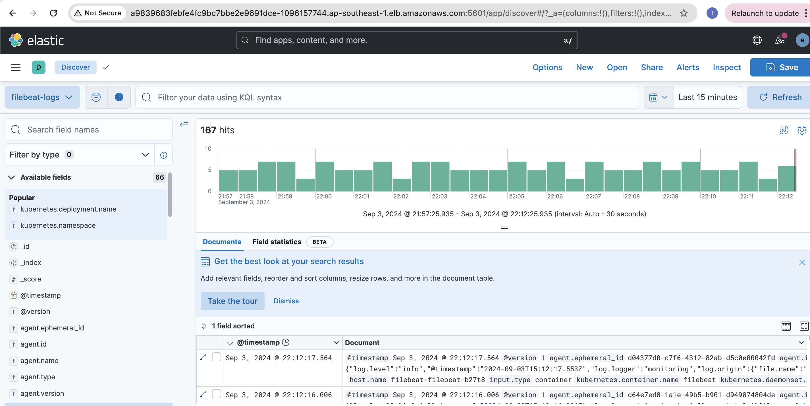

# GTV - DevOps Exercise

Completed sections bellow: `a,b,c,d,f`

All components are into private subnets, so please install VPN Client to access reousces (EKS, Kibana URL)

1. **Struture**: This repo has 2 parts: `terraform` and `helm-charts`

- terraform: IaC for Infrastructure
- helm-charts: Install components for EKS cluster and applications (ebs storage class, load balancer driver controler, ELK stack...)

    2.**Terraform**

    - Backend state is stored by S3 bucket and DynamoDB

    - Run`terraform init` to install providers, modules...

    - Run`terraform output` to check resources was created (VPC, subnets, VPN server...)

    - To get public/private key of keypair for login EC2 (VPN server), run`terraform output -raw private_key` or `terraform output -raw public_key`

3. **ELK Stack**

    - Install Elasticsearch, Logstash, Kibana, Filebeat by value file`gtv-values.yaml` into each helm chart folder

    - Kibana URL by ALB Internal:`a9839683febfe4fc9bc7bbe2e9691dce-1096157744.ap-southeast-1.elb.amazonaws.com:5601` (`elastic/p8nLFWqmjCfq1pXZAu3x`)

